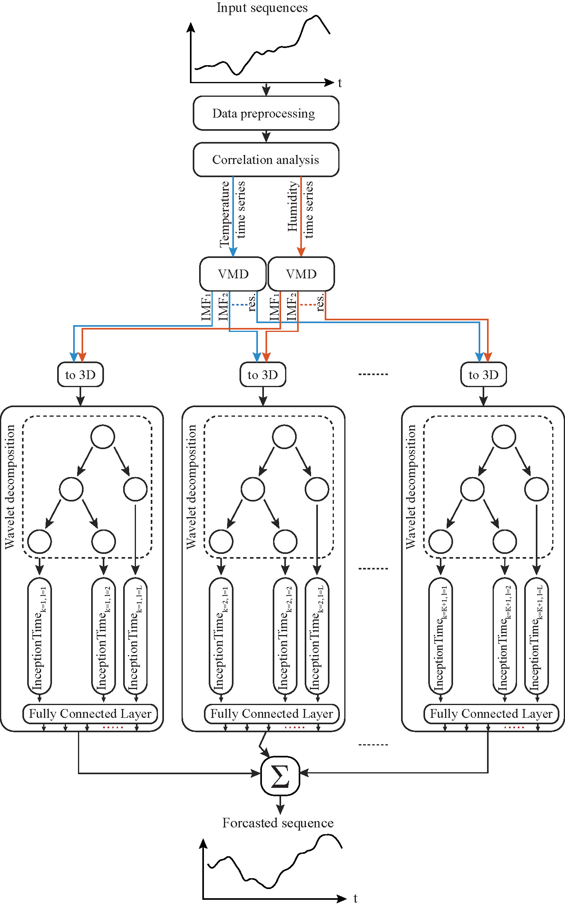

# Predictive Analytics of Air Temperature in Alaskan Permafrost Terrain Leveraging Two-Level Signal Decomposition and Deep Learning

This repository contains the implementation and results of the paper introducing a novel VMD-WT-InceptionTime model for short-term air temperature forecasting in Alaska.

---

## Abstract

Local weather forecasts in Arctic regions face challenges due to sparse observation stations and high computational costs. Accurate temperature predictions are essential for managing winter hazards and spring flood risks. This study proposes a hybrid **Variational Mode Decomposition (VMD)-Wavelet Transform (WT)-InceptionTime** model to address these challenges. The model is validated using over 35 years of data from three Alaskan locations and evaluated against various state-of-the-art baselines.


---

## Key Contributions

- **Hybrid VMD-WT-InceptionTime Model**: Combines VMD and WT decompositions for feature extraction and uses InceptionTime for forecasting.w
- **Comprehensive Evaluation**: Benchmarked against ARIMA, SVR, LSTM, and more, using four key metrics: RMSE, MAPE, R², and MDA.
- **Data Utilization**: Processes 35+ years of historical temperature data from three Alaskan sites.
- **Optimal Decomposition Analysis**: Determines the best decomposition levels for temperature forecasting.

---

## Citation

```bibtex
@article{ahajjam2024predictive,
  title={Predictive Analytics of Air Temperature in Alaskan Permafrost Terrain Leveraging Two-Level Signal Decomposition and Deep Learning},
  author={Ahajjam, Aymane and Putkonen, Jaakko and Chukwuemeka, Emmanuel and Chance, Robert and Pasch, Timothy J},
  journal={Forecasting},
  volume={6},
  number={1},
  pages={55--80},
  year={2024},
  publisher={MDPI}
}